# TalentIQ Project Architecture And Feature Guide

Version: generated from the current repository state
Audience: developers, reviewers, maintainers, product engineers, deployment owners
Format note: this markdown is intentionally long and detailed so that, when rendered to PDF or viewed in a markdown preview with normal page sizing, it expands into a large multi-page project handbook.

---

## 1. Document Purpose

This document explains the TalentIQ project from end to end:

- what the platform does
- how the frontend and backend are organized
- how each major feature works
- how data flows from browser to API to database and background jobs
- which libraries and dependencies are used
- how the codebase is structured
- where important files live
- how features connect to each other
- how the system can be extended safely

The goal is not only to describe the user-facing features, but also to document the engineering decisions visible in the current repository.

---

## 2. Executive Overview

TalentIQ is a full-stack AI career platform built around the job-seeking lifecycle.

It combines:

- resume upload and ATS-style analysis
- job description analysis and resume-job matching
- AI career copilot and writing assistant tools
- mock interviews and interview replay
- live interview rooms with code execution
- job application tracking and analytics
- collaborative study and group features
- an automated job application bot
- an in-progress mobile client

At a high level:

- the frontend is a Next.js application using React and TypeScript
- the backend is a FastAPI service using async SQLAlchemy and PostgreSQL
- Redis and Celery support asynchronous processing and scheduled tasks
- AI calls are routed through OpenRouter-compatible APIs
- Clerk handles authentication
- Stream services support video and chat experiences
- pgvector is used to support embedding storage

---

## 3. Product Vision

TalentIQ is designed as a single workspace for candidates instead of a set of disconnected tools.

Most career tools do only one thing:

- resume scoring
- interview practice
- job search
- cover letter generation
- tracker board

TalentIQ tries to unify all of these into one product surface. The important technical result of that decision is that the same entities are reused across features:

- `User`
- `Resume`
- `Job`
- `JobMatch`
- `Interview`
- `LiveRoom`
- `Application`
- group and chat records

This shared data model allows cross-feature intelligence:

- a resume can drive job analysis
- the same resume can drive resume-round mock interviews
- job descriptions can feed cover letter generation
- interview results can feed analytics
- resumes can feed the autobot profile

---

## 4. Technology Stack Summary

### 4.1 Frontend Stack

- Next.js
- React
- TypeScript
- Clerk
- Axios
- Tailwind CSS
- Framer Motion
- Three.js
- React Three Fiber
- Drei
- Stream Video React SDK
- Stream Chat React
- Monaco editor
- Recharts
- React Markdown
- Zustand

### 4.2 Backend Stack

- FastAPI
- Uvicorn
- SQLAlchemy async
- psycopg 3
- PostgreSQL
- pgvector
- Alembic
- Celery
- Redis
- httpx
- OpenAI-compatible client usage through OpenRouter
- PyMuPDF
- Cloudinary
- Stream Chat server SDK
- Playwright

### 4.3 Infrastructure Stack

- Docker Compose
- PostgreSQL with pgvector image
- Redis
- Piston execution engine
- backend container
- Celery worker
- Celery beat
- frontend container

---

## 5. Workspace Layout

The repository is a multi-part workspace with these main areas:

```text
talent-IQ-master/
|- backend/
|  |- src/
|  |  |- api/
|  |  |- autobot/
|  |  |- core/
|  |  |- data/
|  |  |- models/
|  |  |- schemas/
|  |  |- services/
|  |  |- workers/
|  |  `- main.py
|  |- alembic/
|  |- requirements.txt
|  `- Dockerfile
|- frontend/
|  |- src/
|  |  |- app/
|  |  |- components/
|  |  `- lib/
|  |- package.json
|  `- Dockerfile
|- mobile/
|- screenshots/
|- docker-compose.yml
|- docker-compose.prod.yml
|- package.json
|- README.md
`- deployment and helper scripts
```

### 5.1 Root-Level Meaning

- `backend/`: Python API, business logic, workers, database models
- `frontend/`: web app pages, shared UI, 3D widgets, API client helpers
- `mobile/`: Flutter mobile application work-in-progress
- `screenshots/`: visual documentation assets
- `docker-compose.yml`: local dev infrastructure and service orchestration
- `package.json`: workspace-level helper scripts

---

## 6. Runtime Architecture

The runtime architecture is easier to understand through a layered view.

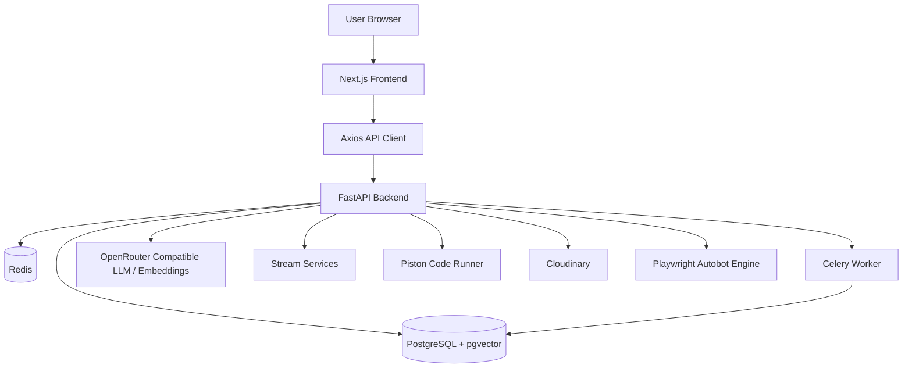

### 6.1 What This Means In Practice

- the browser renders UI and initiates feature actions
- Axios sends authenticated requests to the FastAPI backend
- the backend validates the user and feature flags
- synchronous work happens directly in request handlers
- long-running work is delegated to Celery workers where appropriate
- structured and unstructured records are stored in PostgreSQL
- vector embeddings are stored using pgvector
- AI generation and embedding calls are delegated to external AI endpoints
- Stream services power communication and live-room style experiences
- Piston executes code in live technical interview scenarios

---

## 7. Root Workspace Scripts

The root `package.json` defines workspace convenience commands:

```json
{
  "scripts": {
    "dev:frontend": "npm run dev --prefix frontend",
    "dev:backend": "cd backend && uvicorn src.main:app --reload",
    "install:all": "npm install --prefix frontend && pip install -r backend/requirements.txt",
    "docker:up": "docker-compose up --build",
    "docker:down": "docker-compose down"
  }
}
```

### 7.1 Why This Matters

- frontend and backend can be started independently
- local development can happen with or without Docker
- there is a single place to bootstrap the whole repo

---

## 8. Frontend Architecture

### 8.1 Frontend Entry Model

The frontend uses the App Router structure under `frontend/src/app`.

Important route files:

- `app/page.tsx`
- `app/dashboard/page.tsx`
- `app/resume/page.tsx`
- `app/job-analysis/page.tsx`
- `app/copilot/page.tsx`
- `app/mock-interview/page.tsx`
- `app/live-interview/page.tsx`
- `app/interview-replay/page.tsx`
- `app/tracker/page.tsx`
- `app/analytics/page.tsx`
- `app/autobot/page.tsx`
- `app/roadmap/page.tsx`
- `app/groups/page.tsx`
- `app/studynotion/page.tsx`

### 8.2 Global Layout

The file `frontend/src/app/layout.tsx` wraps the application in:

- `ClerkProvider`
- `ThemeProvider`
- global fonts
- global CSS

This means authentication, theme state, and typography are established at the application root instead of per-page.

### 8.3 Middleware

`frontend/src/middleware.ts` uses `clerkMiddleware()`.

This means:

- authentication middleware runs for matched routes
- static assets are excluded
- API and app routes remain covered where needed

### 8.4 API Communication Layer

`frontend/src/lib/api.ts` centralizes outbound API communication.

Key details:

- base URL comes from `NEXT_PUBLIC_API_URL`
- every request gets an `x-request-id`
- frontend logs API failures to the console
- feature-specific client helpers are grouped by domain:
  - `authApi`
  - `resumeApi`
  - `jobApi`
  - `interviewApi`
  - `platformApi`
  - `trackerApi`
  - `copilotApi`
  - `analyticsApi`
  - `matchApi`
  - `groupApi`

This structure improves consistency and reduces repeated Axios logic.

---

## 9. Frontend Route Map

### 9.1 Public And Auth Routes

| Route | Primary File | Purpose |
|---|---|---|
| `/` | `frontend/src/app/page.tsx` | marketing and landing experience |
| `/how-it-works` | `frontend/src/app/how-it-works/page.tsx` | feature walkthrough |
| `/sign-in` | `frontend/src/app/(auth)/sign-in/[[...sign-in]]/page.tsx` | authentication entry |
| `/sign-up` | `frontend/src/app/(auth)/sign-up/[[...sign-up]]/page.tsx` | account creation |

### 9.2 Core Product Routes

| Route | File | Main Responsibility |
|---|---|---|
| `/dashboard` | `frontend/src/app/dashboard/page.tsx` | central summary hub |
| `/resume` | `frontend/src/app/resume/page.tsx` | resume upload, parse, ATS and quality view |
| `/job-analysis` | `frontend/src/app/job-analysis/page.tsx` | JD parsing and match scoring |
| `/copilot` | `frontend/src/app/copilot/page.tsx` | AI mentor and helper actions |
| `/mock-interview` | `frontend/src/app/mock-interview/page.tsx` | interview practice engine |
| `/live-interview` | `frontend/src/app/live-interview/page.tsx` | live room experience |
| `/interview-replay` | `frontend/src/app/interview-replay/page.tsx` | post-interview replay and review |
| `/tracker` | `frontend/src/app/tracker/page.tsx` | application tracking |
| `/analytics` | `frontend/src/app/analytics/page.tsx` | analytics views |
| `/roadmap` | `frontend/src/app/roadmap/page.tsx` | role-based learning roadmap |
| `/groups` | `frontend/src/app/groups/page.tsx` | community and collaboration |
| `/autobot` | `frontend/src/app/autobot/page.tsx` | auto-apply engine control panel |
| `/studynotion` | `frontend/src/app/studynotion/page.tsx` | learning integration |

---

## 10. Frontend Component Architecture

The frontend is not only route-driven; it also has a reusable component system.

Typical component categories include:

- layout wrappers
- navigation
- common UI atoms
- animated UI elements
- 3D scene objects
- score and badge components

### 10.1 Notable Shared UI Responsibilities

- `DashboardLayout.tsx`: application shell and protected page layout
- `Navbar.tsx`: top navigation
- `Footer.tsx`: footer and lower-level navigation
- `ProgressArc.tsx`, `ScoreChip.tsx`, `StatusDot.tsx`: visual indicators
- `AITyping.tsx`, `TypingText.tsx`: streaming/typing visual presentation
- `GlassCard.tsx`, `GlowButton.tsx`: visual style primitives

### 10.2 3D Experience Components

The codebase includes multiple 3D components such as:

- `HeroGlobe.tsx`
- `HeroScene.tsx`
- `InterviewAvatar3D.tsx`
- `ResumeOrb.tsx`
- `ScoreRing3D.tsx`
- `SkillGraph3D.tsx`
- `RoomParticles.tsx`

These are used to differentiate TalentIQ from ordinary dashboard applications and create a premium product identity.

---

## 11. Frontend Libraries And Why They Exist

### 11.1 Authentication

- `@clerk/nextjs`
  - used for session management and auth integration
  - wraps app layout and middleware

### 11.2 Networking

- `axios`
  - used for backend communication
  - allows interceptors and centralized request handling

### 11.3 3D Visual Layer

- `three`
- `@react-three/fiber`
- `@react-three/drei`
- `@react-three/postprocessing`
- `@react-three/rapier`

These are used to create immersive visualization and animated scene-based UI.

### 11.4 Motion And Interaction

- `framer-motion`
  - used for transitions, reveals, interactive card behavior

### 11.5 Productivity And Helpers

- `clsx`
- `tailwind-merge`
- `dequal`
- `zustand`

These support styling, state helpers, and value comparison patterns.

### 11.6 Rich Experiences

- `@stream-io/video-react-sdk`
- `stream-chat`
- `stream-chat-react`
- `@monaco-editor/react`
- `react-markdown`
- `recharts`
- `react-dropzone`

These support:

- video rooms
- chat
- code editor experiences
- markdown rendering
- charts
- drag-and-drop upload

---

## 12. Backend Architecture

### 12.1 Backend Entry Point

The backend starts from `backend/src/main.py`.

Its responsibilities include:

- creating the FastAPI app
- configuring lifespan behavior
- initializing database schema bootstrapping
- closing Redis on shutdown
- configuring CORS
- request observability middleware
- mounting routers
- exposing health endpoints
- mounting upload directories as static files

### 12.2 Router-Centric Organization

The backend splits features by API router:

| Router File | Prefix | Responsibility |
|---|---|---|
| `auth_router.py` | `/auth` | user sync, auth integration |
| `resume_router.py` | `/resumes` | upload, list, fetch, improve, versions |
| `job_router.py` | `/jobs` | JD parsing and storage |
| `job_router.py` | `/matches` | resume-vs-job matching |
| `ai_router.py` | `/copilot` | AI copilot, cover letters, roadmap, writing tools |
| `interview_router.py` | `/interviews` | mock interview lifecycle and replay |
| `live_room_router.py` | `/rooms` | live interview room creation and code execution |
| `tracker_router.py` | `/applications` | tracker CRUD and analytics |
| `analytics_router.py` | `/analytics` | dashboard metrics and reporting |
| `group_router.py` | `/groups` | community, members, files, messages, shared code |
| `autobot_router.py` | `/autobot` | job automation control plane |

### 12.3 Backend Layered Model

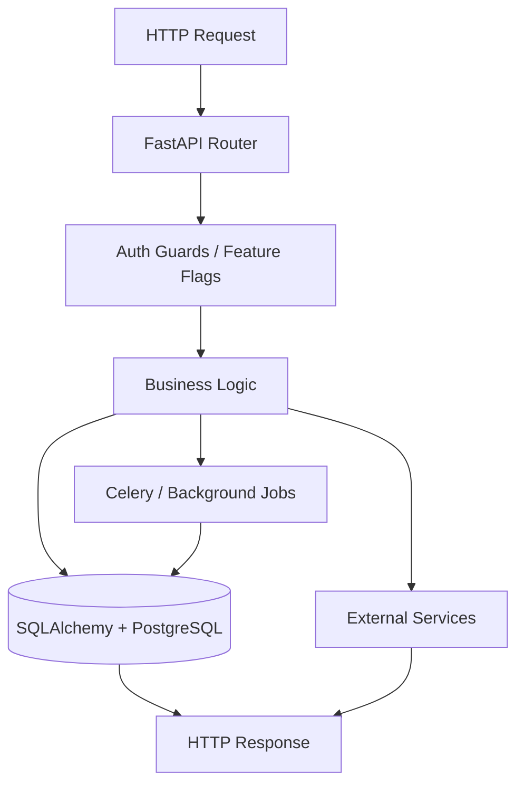

The codebase does not enforce a strict enterprise service abstraction everywhere, but you can still see these layers:

- API routers
- core utilities and guards
- models
- services
- workers
- static data and fallback content

---

## 13. Backend Core Modules

### 13.1 Database Core

File: `backend/src/core/db.py`

Responsibilities:

- loads `DATABASE_URL`
- normalizes URLs to `postgresql+psycopg_async://`
- creates async SQLAlchemy engine
- creates `AsyncSessionLocal`
- provides `get_db()`
- initializes pgvector extension and tables
- performs some development-time schema safety updates

Important design note:

The code mixes:

- ORM model registration
- `create_all`
- some inline `ALTER TABLE IF NOT EXISTS` compatibility logic

This improves local resilience, but in mature production environments, Alembic should remain the source of truth for schema changes.

### 13.2 Auth Core

File: `backend/src/core/auth.py`

Responsibilities:

- verify Clerk bearer tokens
- optionally allow insecure decode in non-production development
- auto-create a user record if a valid Clerk identity exists but DB sync has not happened yet
- enforce role constraints:
  - `require_candidate`
  - `require_recruiter`
  - `require_admin`

This is developer-friendly because local polling loops and delayed webhooks do not completely break the app during development.

### 13.3 Feature Flags

File: `backend/src/core/feature_flags.py`

Flags currently exposed:

- `copilot_enabled`
- `live_room_enabled`
- `resume_pipeline_enabled`
- `interview_replay_enabled`
- `roadmap_enabled`
- `portfolio_eval_enabled`

Why this matters:

- features can be disabled without code deletion
- frontend can query `/v1/platform/flags`
- routers can gate endpoints using `require_feature()`

---

## 14. Backend Models

The repository registers these important model groups:

- users
- resumes
- jobs and job matches
- interviews and questions
- live rooms and chat
- groups and group messages
- document embeddings
- tracker/application entities

### 14.1 Core Domain Objects

#### User

Used for:

- Clerk identity mapping
- role enforcement
- profile-level candidate data
- platform credentials for autobot behavior

#### Resume

Used for:

- uploaded PDF metadata
- parsed structured resume data
- ATS score
- quality score
- raw extracted text
- resume versioning
- resume embeddings

#### Job And JobMatch

Used for:

- parsed job description storage
- match score calculation
- missing skill and recommendation generation

#### Interview And InterviewQuestion

Used for:

- mock interview runs
- question persistence
- score tracking
- replay generation

#### LiveRoom

Used for:

- live interview sessions
- room lifecycle and participant operations

#### Group And GroupMessage

Used for:

- collaborative group features
- group chat behavior
- shared code support

#### DocumentEmbedding

Used for:

- storing vector embeddings
- linking semantic chunks to source resume documents

---

## 15. Backend Services

The service layer contains reusable helper classes and operations:

| Service File | Purpose |
|---|---|
| `ai_copilot_service.py` | AI-related orchestration helpers |
| `code_execution_service.py` | external code execution through Piston |
| `job_service.py` | job matching/business helpers |
| `mock_interview_service.py` | interview question and evaluation helpers |
| `resume_service.py` | resume processing helpers |
| `scoring_service.py` | ATS and scoring logic |
| `stream_service.py` | Stream token and channel utilities |

### 15.1 Why This Layer Exists

The routers are the HTTP contract surface.
The services are where reusable logic can live without coupling everything directly to route handlers.

Even where logic still lives in routers, the presence of service files shows a path toward cleaner separation for future refactoring.

---

## 16. Background Jobs And Workers

The project uses Celery for asynchronous and scheduled processing.

File: `backend/src/workers/celery_app.py`

Included task groups:

- `resume_tasks`
- `job_tasks`
- `embed_tasks`
- `notify_tasks`
- `retention_tasks`

Queues:

- `high`
- `default`
- `low`

Beat schedules:

- retention cleanup hourly
- application reminders every 15 minutes

### 16.1 Resume Worker Example

File: `backend/src/workers/resume_tasks.py`

The resume pipeline:

1. fetch the resume PDF
2. extract text using PyMuPDF
3. parse structured resume fields
4. calculate ATS score
5. mark the resume as `done`
6. generate embeddings asynchronously
7. write embeddings to `document_embeddings`

This is a strong example of a user-first asynchronous design:

- the UI unblocks when parsing is done
- embedding generation continues after parse completion

---

## 17. Infrastructure And Docker

The `docker-compose.yml` file defines a local development stack.

### 17.1 Services

| Service | Role |
|---|---|
| `postgres` | persistent relational store with pgvector |
| `redis` | Celery broker and backend |
| `piston` | remote code execution |
| `backend` | FastAPI app |
| `worker` | Celery worker |
| `beat` | Celery scheduler |
| `frontend` | Next.js web app |

### 17.2 Local Architecture Diagram

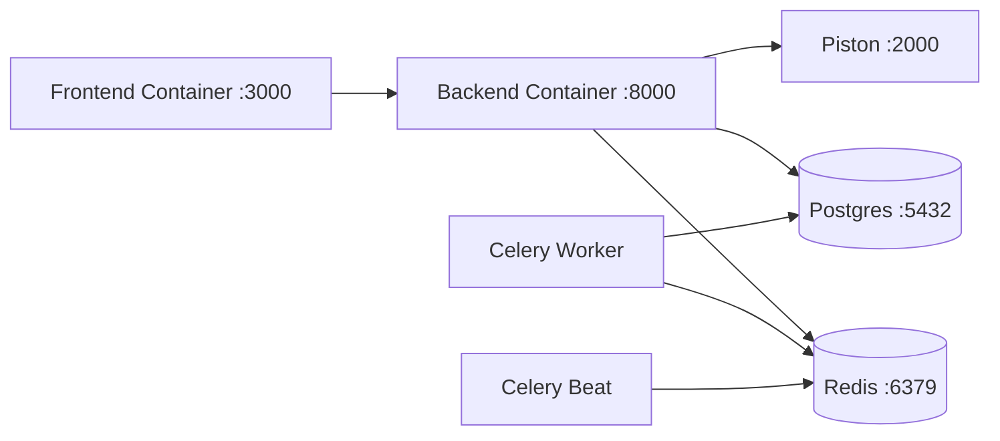

### 17.3 Why This Setup Is Practical

- one command can boot the full stack
- workers are isolated from API processes
- code execution is isolated through a dedicated engine
- PostgreSQL and Redis are explicit infrastructure dependencies

---

## 18. End-To-End Request Lifecycle

This pattern repeats across many features.

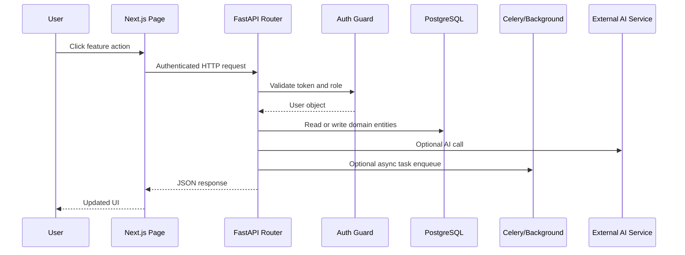

---

## 19. Feature Deep Dive: Resume Intelligence

### 19.1 Goal

This feature transforms a raw uploaded PDF into:

- parsed structured data
- ATS score
- quality score
- potentially improved content
- semantic embeddings for future AI use

### 19.2 Frontend Entry

Main page:

- `frontend/src/app/resume/page.tsx`

The page handles:

- PDF selection and drag-drop
- target role selection
- experience level selection
- upload start
- polling for parse completion
- visual display of ATS and quality scores
- suggestions and derived helper outputs

### 19.3 Backend Endpoints

Primary endpoints:

- `POST /v1/resumes/upload`
- `GET /v1/resumes`
- `GET /v1/resumes/{resume_id}`
- `POST /v1/resumes/{resume_id}/improve`
- `GET /v1/resumes/{resume_id}/versions`

### 19.4 Resume Workflow Diagram

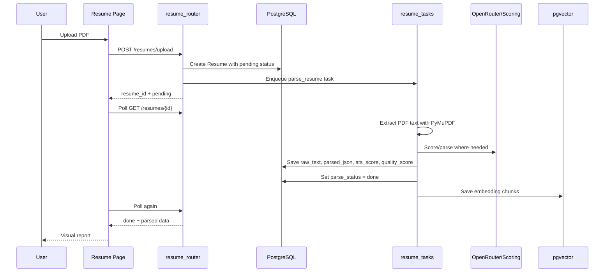

### 19.5 Backend Workflow Breakdown

#### Upload Stage

The upload route:

- checks file type is PDF
- checks size constraints
- stores the file in Cloudinary or falls back to a data URL in development
- creates a `Resume` record with `parse_status="pending"`
- enqueues a Celery task or launches an async dev fallback

#### Parse Stage

`resume_tasks.py`:

- uses `fitz` from PyMuPDF
- extracts page text
- builds parsed JSON through `extract_resume_data()`
- scores ATS through `calculate_ats_score()`
- stores structured results

#### Embedding Stage

After parse completion:

- raw text is chunked
- embeddings are requested
- chunk vectors are stored in `DocumentEmbedding`

### 19.6 Why This Feature Is Well-Designed

- parsing does not block the browser request
- users can see completion quickly
- the system keeps both raw and structured representations
- ATS scoring and vectorization can power later features

### 19.7 Related Files

Frontend:

- `frontend/src/app/resume/page.tsx`
- `frontend/src/lib/api.ts`
- `frontend/src/components/3d/ResumeOrb.tsx`

Backend:

- `backend/src/api/resume_router.py`
- `backend/src/workers/resume_tasks.py`
- `backend/src/models/resume.py`
- `backend/src/services/scoring_service.py`
- `backend/src/models/embeddings.py`

---

## 20. Feature Deep Dive: Job Analysis And Matching

### 20.1 Goal

This feature compares a job description against a candidate resume and produces:

- structured JD parsing
- match score
- missing skill list
- bonus skill list
- recommendations
- ATS simulation support

### 20.2 Frontend Entry

Primary page:

- `frontend/src/app/job-analysis/page.tsx`

Page responsibilities:

- capture pasted job description
- call backend JD analysis
- fetch or select a parsed resume
- request a resume-job match
- render score breakdown and gap analysis

### 20.3 Backend Endpoints

Primary endpoints:

- `POST /v1/jobs/analyze`
- `GET /v1/jobs/{job_id}`
- `POST /v1/matches/create`
- likely related retrieval and recommendation endpoints under `/matches`

### 20.4 Workflow Diagram

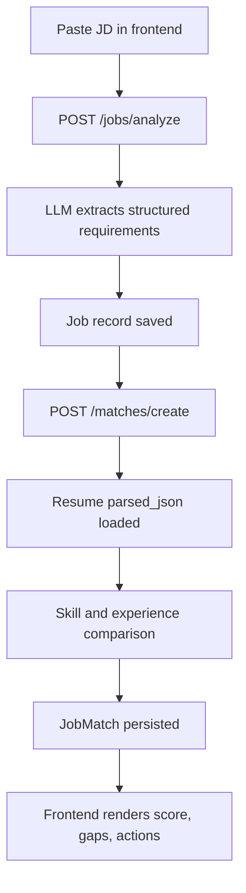

### 20.5 Important Backend Logic

The job router includes defensive handling:

- `_sanitize_jd_text()` removes likely resume contamination from the pasted JD
- `_fallback_extract_skills()` provides keyword fallback if LLM extraction is weak
- `_normalize_parsed_requirements()` normalizes must-have, nice-to-have, bonus, tools, education, and warnings
- `_ensure_resume_skills()` ensures resume skill data remains usable even if parsed JSON is sparse

These safeguards matter because user input is often noisy in real career products.

### 20.6 Why This Feature Is Strong

- it does not trust AI output blindly
- it adds fallback logic
- it preserves warnings and confidence signals
- it supports direct integration with resume-derived data

### 20.7 Related Files

Frontend:

- `frontend/src/app/job-analysis/page.tsx`
- `frontend/src/lib/api.ts`
- `frontend/src/components/3d/SkillGraph3D.tsx`

Backend:

- `backend/src/api/job_router.py`
- `backend/src/models/job.py`
- `backend/src/services/job_service.py`
- `backend/src/services/scoring_service.py`

---

## 21. Feature Deep Dive: AI Career Copilot

### 21.1 Goal

The AI Copilot acts as a persistent assistant for:

- general career advice
- writing help
- company prep
- cover letter generation
- roadmap generation
- interview question generation
- portfolio ingestion and evaluation

### 21.2 Backend Endpoints

Important endpoints under `/v1/copilot`:

- `POST /chat`
- `POST /cover-letter`
- `POST /roadmap`
- `GET /roadmap/options`
- `POST /questions`
- `POST /writing-assistant`
- `POST /company-prep`
- `POST /portfolio/ingest`
- `POST /portfolio/evaluate`

### 21.3 Streaming Chat Diagram

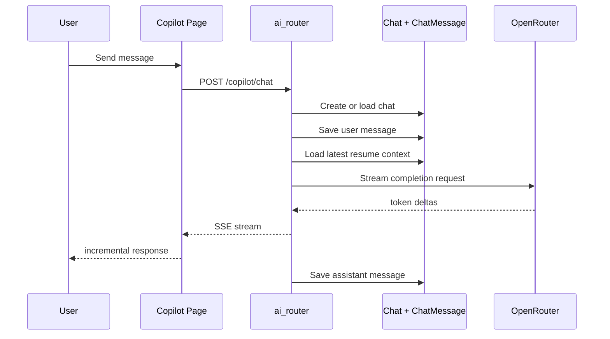

### 21.4 Technical Highlights

- intent detection attempts to classify the user request
- latest resume data is injected into context
- the route uses `StreamingResponse`
- assistant output is saved after stream completion

This creates a better UX than waiting for a single long blocking response.

### 21.5 Related Files

Frontend:

- `frontend/src/app/copilot/page.tsx`
- `frontend/src/lib/api.ts`
- `frontend/src/components/ui/AITyping.tsx`

Backend:

- `backend/src/api/ai_router.py`
- `backend/src/services/ai_copilot_service.py`
- `backend/src/models/live_room.py` for chat entities

---

## 22. Feature Deep Dive: Mock Interview Engine

### 22.1 Goal

This feature gives users practice interviews tailored to:

- role
- round type
- persona
- resume context, especially with the new resume round mode

### 22.2 Frontend Entry

Main page:

- `frontend/src/app/mock-interview/page.tsx`

The page supports:

- role selection
- round-type selection
- recruiter persona selection
- question-answer loop
- timer-based interview pacing
- voice input
- feedback and score per question
- final report
- interview replay navigation
- resume upload and selection for resume round

### 22.3 Backend Endpoints

Important endpoints:

- `GET /v1/interviews/options`
- `GET /v1/interviews/`
- `POST /v1/interviews/start`
- `POST /v1/interviews/{interview_id}/answer`
- `POST /v1/interviews/{interview_id}/finish`
- `GET /v1/interviews/{interview_id}/report`
- `GET /v1/interviews/{interview_id}/replay`

### 22.4 Mock Interview Workflow

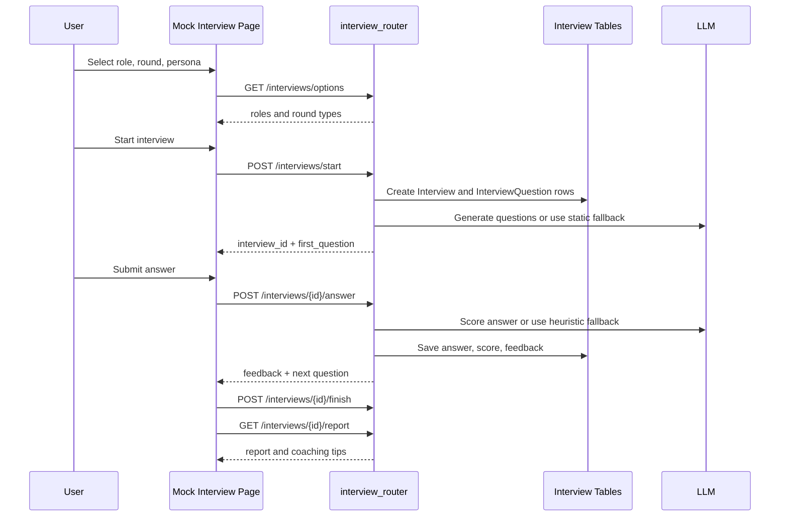

### 22.5 Resume Round Addition

The codebase now includes `Resume round`.

What it does:

- exposes `Resume round` in round types
- allows a user to upload or select a resume in the mock interview page
- sends `resume_id` to the backend
- generates resume-only questions
- avoids generic theory unless anchored to resume content
- supports deterministic fallback questions if AI generation fails

### 22.6 Why The Design Is Good

- it combines static fallback with AI generation
- it persists interview questions and answers
- it separates question generation and answer scoring
- it enables replay and analytics later

### 22.7 Related Files

Frontend:

- `frontend/src/app/mock-interview/page.tsx`
- `frontend/src/components/3d/InterviewAvatar3D.tsx`
- `frontend/src/components/3d/ScoreRing3D.tsx`

Backend:

- `backend/src/api/interview_router.py`
- `backend/src/data/interview_data.py`
- `backend/src/models/interview.py`
- `backend/src/services/mock_interview_service.py`

---

## 23. Feature Deep Dive: Interview Replay

### 23.1 Goal

Interview replay lets users inspect a completed session rather than only seeing a final score.

### 23.2 Data Source

During `finish_interview`, the backend builds replay items and writes them into `interview.replay_json`.

Stored replay concepts include:

- sequence
- question
- answer
- score
- delta
- feedback
- dimension scores

### 23.3 Value

This enables:

- post-session review
- visible learning progression
- timeline reconstruction
- analytics reuse

### 23.4 Related Files

- `frontend/src/app/interview-replay/page.tsx`
- `backend/src/api/interview_router.py`
- `backend/src/models/interview.py`

---

## 24. Feature Deep Dive: Live Interview Room

### 24.1 Goal

The live room feature supports synchronous technical interviews or collaborative sessions.

### 24.2 Endpoints

Under `/v1/rooms`:

- `POST /create`
- `POST /{room_id}/join`
- `POST /{room_id}/execute-code`
- `POST /{room_id}/lock`
- `POST /{room_id}/end`

### 24.3 External Integrations

- Stream for room/video identity and channel concepts
- Piston or related code execution path for running code
- Monaco editor on the frontend

### 24.4 Workflow Diagram

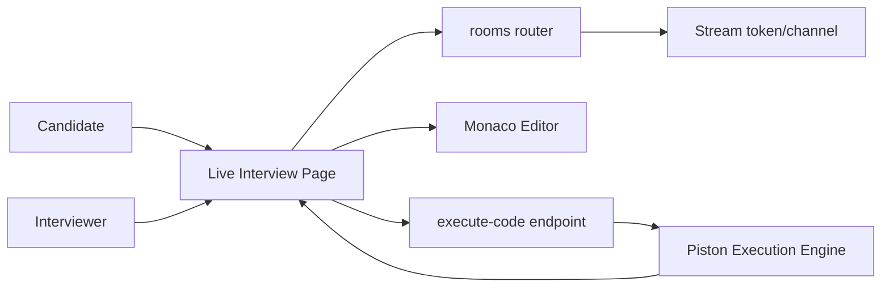

### 24.5 Why This Feature Matters

This is one of the most differentiating features in the platform because it supports:

- real-time interaction
- code collaboration
- interview realism

### 24.6 Related Files

Frontend:

- `frontend/src/app/live-interview/page.tsx`
- Monaco integrations in the frontend

Backend:

- `backend/src/api/live_room_router.py`
- `backend/src/services/stream_service.py`
- `backend/src/services/code_execution_service.py`
- `backend/src/models/live_room.py`

---

## 25. Feature Deep Dive: Tracker

### 25.1 Goal

The tracker feature manages the user's job application pipeline.

### 25.2 Endpoints

Under `/v1/applications`:

- `POST ""`
- `PATCH /{app_id}`
- `GET ""`
- `GET /timeline`
- `GET /analytics`

### 25.3 Workflow

The tracker can be fed by:

- manual user creation
- job-analysis-driven saves
- future automation inputs

### 25.4 Why It Is Important

Without a tracker, resume analysis and interview coaching remain isolated activities.
The tracker closes the loop by tying effort to actual applications.

### 25.5 Related Files

- `frontend/src/app/tracker/page.tsx`
- `backend/src/api/tracker_router.py`
- application-related models under backend models

---

## 26. Feature Deep Dive: Analytics

### 26.1 Goal

Analytics turns many isolated candidate actions into measurable trends.

### 26.2 Endpoints

Under `/v1/analytics`:

- `GET /dashboard`
- `GET /skills`
- `GET /interviews`

### 26.3 Likely Inputs

Analytics can aggregate:

- resume uploads and scores
- application events
- interview scores
- skill development trends

### 26.4 Why This Layer Is Valuable

Analytics elevates the product from a toolset to a feedback system.
It lets users see whether they are improving, not just whether they completed an action.

### 26.5 Related Files

- `frontend/src/app/analytics/page.tsx`
- `backend/src/api/analytics_router.py`

---

## 27. Feature Deep Dive: Roadmap Generator

### 27.1 Goal

This feature creates a 12-week role-based learning roadmap.

### 27.2 Inputs

- target role
- target level
- optional resume context

### 27.3 Behavior

- tries LLM first
- falls back to static roadmap data if unavailable

### 27.4 Why This Pattern Is Good

The feature remains usable even during AI failures because it has static fallback data.

### 27.5 Related Files

Frontend:

- `frontend/src/app/roadmap/page.tsx`

Backend:

- `backend/src/api/ai_router.py`
- `backend/src/data/roadmap_data.py`

---

## 28. Feature Deep Dive: Group Collaboration

### 28.1 Goal

This feature supports collaborative preparation and project work.

### 28.2 Endpoints

Under `/v1/groups`:

- create group
- update shared code
- list groups
- fetch messages
- add members
- remove members
- delete group
- post messages
- upload files
- list files

### 28.3 Collaboration Model

The group feature is more than chat:

- group membership management
- shared code state
- file sharing
- likely chat persistence

### 28.4 Workflow Diagram

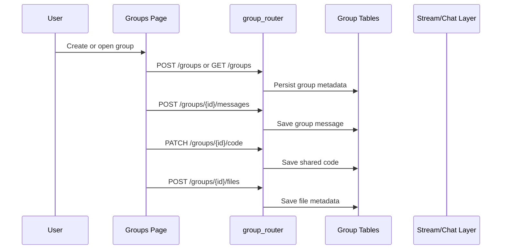

### 28.5 Related Files

- `frontend/src/app/groups/page.tsx`
- `backend/src/api/group_router.py`
- `backend/src/models/group_chat.py`

---

## 29. Feature Deep Dive: Auto Job Bot

### 29.1 Goal

The autobot automates repetitive job application actions across multiple platforms.

### 29.2 Endpoint Surface

Under `/v1/autobot`:

- start
- stop
- status
- logs
- clear logs
- applied jobs
- mark manual status
- delete applied job record
- config
- session state
- credentials
- credentials status
- profile from resume
- profile

### 29.3 Autobot Internal Modules

The internal backend autobot package includes:

- config helpers
- browser handling
- AI answer handling
- deduplication
- LinkedIn automation
- Naukri automation
- Y Combinator automation
- scheduling

### 29.4 Internal Architecture

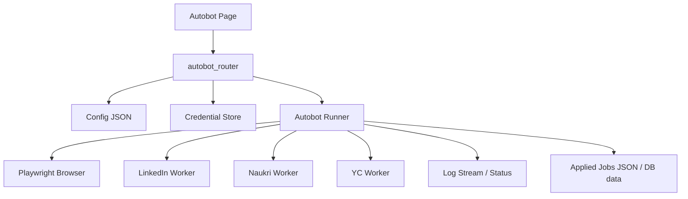

### 29.5 Why This Feature Is Operationally Complex

It touches:

- browser automation
- login persistence
- external sites
- credential handling
- rate controls
- deduplication
- long-running processes
- user-visible logs

This is one of the most operationally sensitive features in the whole project.

### 29.6 Related Files

Backend:

- `backend/src/api/autobot_router.py`
- `backend/src/autobot/core/browser.py`
- `backend/src/autobot/core/linkedin.py`
- `backend/src/autobot/core/naukri.py`
- `backend/src/autobot/core/ycombinator.py`
- `backend/src/autobot/core/dedup.py`
- `backend/src/autobot/core/scheduler.py`
- `backend/src/autobot/core/ai_handler.py`
- `backend/src/autobot/config/job_prefs.example.json`

Frontend:

- `frontend/src/app/autobot/page.tsx`

---

## 30. Feature Deep Dive: Authentication

### 30.1 Frontend

- Clerk middleware
- Clerk provider in root layout
- sign-in and sign-up routes under `(auth)`

### 30.2 Backend

Auth router endpoints:

- `POST /auth/webhook`
- `GET /auth/me`
- `PATCH /auth/me/profile`
- `PATCH /auth/sync`

### 30.3 Flow

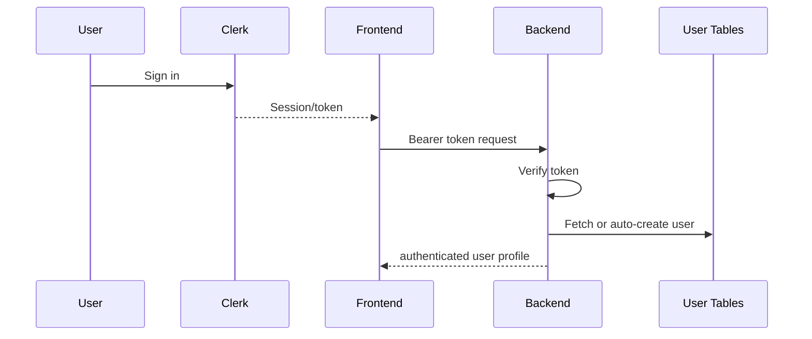

### 30.4 Why The Current Design Works

- local development is resilient
- the API can create a local user if the Clerk webhook has not yet populated data
- role-based access rules are explicit

---

## 31. Feature Deep Dive: Platform Flags

TalentIQ exposes capability flags through:

- `GET /v1/platform/flags`

This is important because frontend experiences can become conditional without requiring full redeploy logic to be embedded into every page component.

Example use cases:

- hide unfinished features
- disable live room
- disable roadmap
- disable portfolio evaluation

---

## 32. Data Flow Patterns Across Features

### 32.1 Resume As A Foundational Asset

Many downstream features depend on `Resume`:

- resume analyzer
- job analysis and matching
- cover letter generation
- copilot context
- interview question generation
- mock interview resume round
- autobot profile inference
- analytics

### 32.2 Job Description As A Foundational Asset

`Job` entities feed:

- job analysis views
- match score logic
- cover letter generation
- company prep context
- application tracking workflows

### 32.3 Interview As A Downstream Reflective Asset

`Interview` feeds:

- report generation
- replay
- analytics
- performance trend views

---

## 33. Shared AI Design Strategy

A clear pattern in the backend is:

- attempt LLM generation first
- sanitize response
- parse JSON if required
- fall back to static or heuristic behavior

This pattern appears in:

- roadmaps
- interview questions
- interview scoring
- coaching tips
- JD parsing

### 33.1 Why This Is Good Engineering

Pure AI dependence creates brittle products.

TalentIQ is stronger because:

- AI outages do not completely destroy user flows
- static or heuristic fallbacks keep the experience functional
- users get continuity
- local development remains possible

---

## 34. Observability And Resilience

### 34.1 Request Observability

The backend adds:

- `x-request-id`
- `x-response-time-ms`
- structured logging context for request metadata

The frontend also injects `x-request-id` through Axios interceptors.

This makes debugging easier across client and server.

### 34.2 Graceful Failure Patterns

Examples present in the codebase:

- insecure JWT decode allowed in dev
- database bootstrap marked non-fatal
- upload directory fallback if permissions fail
- AI fallbacks to static data
- resume upload fallback to inline data URL
- SSE error payloads instead of broken chunked streams

This indicates a practical product-minded engineering style.

---

## 35. Backend Route Inventory

This section lists the visible route surface extracted from the current codebase.

### 35.1 Auth

- `POST /v1/auth/webhook`
- `GET /v1/auth/me`
- `PATCH /v1/auth/me/profile`
- `PATCH /v1/auth/sync`

### 35.2 Resume

- `POST /v1/resumes/upload`
- `GET /v1/resumes`
- `GET /v1/resumes/{resume_id}`
- `POST /v1/resumes/{resume_id}/improve`
- `GET /v1/resumes/{resume_id}/versions`

### 35.3 Jobs And Matches

- `POST /v1/jobs/analyze`
- `GET /v1/jobs/{job_id}`
- match endpoints under `/v1/matches/...`

### 35.4 Copilot

- `POST /v1/copilot/chat`
- `POST /v1/copilot/cover-letter`
- `POST /v1/copilot/roadmap`
- `GET /v1/copilot/roadmap/options`
- `POST /v1/copilot/questions`
- `POST /v1/copilot/writing-assistant`
- `POST /v1/copilot/company-prep`
- `POST /v1/copilot/portfolio/ingest`
- `POST /v1/copilot/portfolio/evaluate`

### 35.5 Interviews

- `GET /v1/interviews/options`
- `GET /v1/interviews/`
- `POST /v1/interviews/start`
- `POST /v1/interviews/{interview_id}/answer`
- `POST /v1/interviews/{interview_id}/finish`
- `GET /v1/interviews/{interview_id}/report`
- `GET /v1/interviews/{interview_id}/replay`

### 35.6 Live Rooms

- `POST /v1/rooms/create`
- `POST /v1/rooms/{room_id}/join`
- `POST /v1/rooms/{room_id}/execute-code`
- `POST /v1/rooms/{room_id}/lock`
- `POST /v1/rooms/{room_id}/end`

### 35.7 Tracker

- `POST /v1/applications`
- `PATCH /v1/applications/{app_id}`
- `GET /v1/applications`
- `GET /v1/applications/timeline`
- `GET /v1/applications/analytics`

### 35.8 Analytics

- `GET /v1/analytics/dashboard`
- `GET /v1/analytics/skills`
- `GET /v1/analytics/interviews`

### 35.9 Groups

- `POST /v1/groups/`
- `PATCH /v1/groups/{group_id}/code`
- `GET /v1/groups/`
- `GET /v1/groups/{group_id}/messages`
- `POST /v1/groups/{group_id}/members`
- `DELETE /v1/groups/{group_id}/members/{email}`
- `DELETE /v1/groups/{group_id}`
- `POST /v1/groups/{group_id}/messages`
- `POST /v1/groups/{group_id}/files`
- `GET /v1/groups/{group_id}/files`

### 35.10 Autobot

- `POST /v1/autobot/start`
- `POST /v1/autobot/stop`
- `GET /v1/autobot/status`
- `GET /v1/autobot/logs`
- `POST /v1/autobot/logs/clear`
- `GET /v1/autobot/applied-jobs`
- `POST /v1/autobot/applied-jobs/{index}/mark`
- `DELETE /v1/autobot/applied-jobs/{index}`
- `GET /v1/autobot/config`
- `GET /v1/autobot/session-state`
- `POST /v1/autobot/credentials`
- `GET /v1/autobot/credentials/status`
- `GET /v1/autobot/profile/from-resume`
- `GET /v1/autobot/profile`

---

## 36. Frontend Feature To Backend Endpoint Mapping

| Frontend Feature | Frontend File | Main Backend Namespace |
|---|---|---|
| Resume Analyzer | `app/resume/page.tsx` | `/resumes` |
| Job Analysis | `app/job-analysis/page.tsx` | `/jobs`, `/matches` |
| Copilot | `app/copilot/page.tsx` | `/copilot` |
| Mock Interview | `app/mock-interview/page.tsx` | `/interviews`, `/resumes` |
| Interview Replay | `app/interview-replay/page.tsx` | `/interviews` |
| Live Interview | `app/live-interview/page.tsx` | `/rooms` |
| Tracker | `app/tracker/page.tsx` | `/applications` |
| Analytics | `app/analytics/page.tsx` | `/analytics` |
| Groups | `app/groups/page.tsx` | `/groups` |
| Autobot | `app/autobot/page.tsx` | `/autobot` |
| Roadmap | `app/roadmap/page.tsx` | `/copilot/roadmap` |

---

## 37. Dependency Breakdown: Frontend

Below is the current dependency picture based on `frontend/package.json`.

### 37.1 Core Runtime

- `next`
- `react`
- `react-dom`

### 37.2 Auth

- `@clerk/nextjs`

### 37.3 Visual And 3D

- `three`
- `@react-three/fiber`
- `@react-three/drei`
- `@react-three/postprocessing`
- `@react-three/rapier`
- `framer-motion`
- `lucide-react`

### 37.4 App Functionality

- `axios`
- `react-dropzone`
- `react-markdown`
- `recharts`
- `zustand`

### 37.5 Collaboration And Media

- `@stream-io/video-react-sdk`
- `stream-chat`
- `stream-chat-react`
- `@monaco-editor/react`

### 37.6 Development Tooling

- `typescript`
- `eslint`
- `eslint-config-next`
- `tailwindcss`
- `@tailwindcss/postcss`

### 37.7 Interpretation

The frontend dependency mix shows that the product is:

- highly interactive
- animation-heavy
- media-aware
- dashboard-oriented
- real-time capable

---

## 38. Dependency Breakdown: Backend

Based on `backend/requirements.txt`.

### 38.1 API Layer

- `fastapi`
- `uvicorn[standard]`

### 38.2 Database Layer

- `sqlalchemy[asyncio]`
- `psycopg[binary]`
- `alembic`
- `pgvector`

### 38.3 Auth And Request Utilities

- `python-multipart`
- `python-jose[cryptography]`
- `svix`
- `httpx`
- `python-dotenv`

### 38.4 Async Background Work

- `celery[redis]`
- `redis`

### 38.5 AI And Parsing

- `openai`
- `PyMuPDF`
- `cloudinary`

### 38.6 Collaboration / Extra Services

- `stream-chat`

### 38.7 Automation

- `playwright`
- `playwright-stealth`
- `rich`

### 38.8 Interpretation

The backend is designed to support:

- async API work
- structured persistence
- background processing
- file handling
- AI orchestration
- browser automation

---

## 39. Directory Tree Reference

This section gives a practical tree-style understanding instead of a purely conceptual one.

### 39.1 Backend Important Tree

```text
backend/src/
|- api/
|  |- ai_router.py
|  |- analytics_router.py
|  |- auth_router.py
|  |- autobot_router.py
|  |- group_router.py
|  |- interview_router.py
|  |- job_router.py
|  |- live_room_router.py
|  |- resume_router.py
|  `- tracker_router.py
|- autobot/
|  |- config/
|  `- core/
|- core/
|  |- auth.py
|  |- db.py
|  |- feature_flags.py
|  |- openrouter_client.py
|  `- redis.py
|- data/
|  |- interview_data.py
|  `- roadmap_data.py
|- models/
|  |- embeddings.py
|  |- group_chat.py
|  |- interview.py
|  |- job.py
|  |- live_room.py
|  |- resume.py
|  `- user.py
|- services/
|  |- ai_copilot_service.py
|  |- code_execution_service.py
|  |- job_service.py
|  |- mock_interview_service.py
|  |- resume_service.py
|  |- scoring_service.py
|  `- stream_service.py
|- workers/
|  |- celery_app.py
|  |- embed_tasks.py
|  |- job_tasks.py
|  |- notify_tasks.py
|  |- resume_tasks.py
|  `- retention_tasks.py
`- main.py
```

### 39.2 Frontend Important Tree

```text
frontend/src/
|- app/
|  |- (auth)/
|  |- analytics/
|  |- autobot/
|  |- copilot/
|  |- dashboard/
|  |- groups/
|  |- how-it-works/
|  |- interview-replay/
|  |- job-analysis/
|  |- live-interview/
|  |- mock-interview/
|  |- resume/
|  |- roadmap/
|  |- studynotion/
|  |- tracker/
|  |- globals.css
|  |- layout.tsx
|  `- page.tsx
|- components/
|  |- 3d/
|  |- ui/
|  |- DashboardLayout.tsx
|  |- Footer.tsx
|  `- Navbar.tsx
`- lib/
   |- api.ts
   |- featureFlags.ts
   |- ThemeProvider.tsx
   `- utils.ts
```

---

## 40. Data Persistence Strategy

### 40.1 PostgreSQL

Used for:

- users
- profiles
- resumes
- versions
- jobs
- matches
- interviews
- live rooms
- chats
- applications
- groups
- files and message metadata

### 40.2 pgvector

Used for:

- document embeddings for resumes
- semantic retrieval possibilities

### 40.3 Redis

Used for:

- Celery broker
- Celery result backend

### 40.4 File Storage Strategy

Resume files:

- Cloudinary in preferred environments
- base64 data URL fallback in local development

Uploads directory:

- mounted through FastAPI static files
- permission fallback to temp directory if necessary

---

## 41. Security Considerations

### 41.1 Strengths Visible In Code

- bearer token enforcement in backend routes
- role-based route guards
- Clerk integration
- feature gating
- static file handling under explicit mount
- request IDs for tracing

### 41.2 Areas That Need Care In Production

- insecure JWT decoding should remain development-only
- browser automation credentials need strict operational handling
- AI prompts may contain sensitive user content
- file uploads need malware and content checks if public deployment grows
- code execution should remain isolated and rate-limited

---

## 42. Performance Considerations

### 42.1 Frontend

- dynamic import is used for heavy 3D components
- interactive pages rely on client rendering
- charts and 3D scenes should be monitored for bundle size and runtime performance

### 42.2 Backend

- async SQLAlchemy reduces blocking during API operations
- background tasks move heavy resume parsing out of request paths
- embedding generation is capped for cost and performance
- SSE avoids waiting for full chat output before rendering

### 42.3 Potential Bottlenecks

- large PDF parsing
- LLM latency
- browser automation sessions
- live room code execution spikes
- verbose frontend pages with many interactive widgets

---

## 43. Development Workflow

### 43.1 Running Locally Without Docker

Typical flow:

1. install frontend packages
2. install backend Python requirements
3. run PostgreSQL and Redis locally
4. start backend with Uvicorn
5. start frontend with Next.js

### 43.2 Running With Docker

Typical flow:

1. `docker-compose up --build`
2. wait for health checks
3. open frontend on port `3000`
4. backend listens on `8000`

### 43.3 Why Both Paths Matter

- Docker is closer to a reproducible stack
- direct local mode is often faster for UI or API debugging

---

## 44. File-By-File Purpose Notes

This section gives direct short descriptions for many important files.

### 44.1 Root

- `README.md`: visual and feature-level overview
- `DEPLOY.md`: deployment notes
- `docker-compose.yml`: local stack
- `docker-compose.prod.yml`: production stack overlay
- `package.json`: workspace scripts
- `dev.ps1`, `init.ps1`: helper scripts for local setup

### 44.2 Backend Core

- `backend/src/main.py`: API app construction and router registration
- `backend/src/core/db.py`: database engine and session management
- `backend/src/core/auth.py`: token verification and role guards
- `backend/src/core/feature_flags.py`: feature flag helpers
- `backend/src/core/openrouter_client.py`: AI client abstraction
- `backend/src/core/redis.py`: Redis lifecycle helpers

### 44.3 Backend Domain

- `backend/src/models/user.py`: user and profile related entities
- `backend/src/models/resume.py`: resume and version entities
- `backend/src/models/job.py`: job and match entities
- `backend/src/models/interview.py`: interview and question entities
- `backend/src/models/live_room.py`: live room and chat models
- `backend/src/models/group_chat.py`: group collaboration entities
- `backend/src/models/embeddings.py`: vector storage entities

### 44.4 Backend Features

- `backend/src/api/resume_router.py`: resume feature API
- `backend/src/api/job_router.py`: JD parsing and matching API
- `backend/src/api/ai_router.py`: copilot feature API
- `backend/src/api/interview_router.py`: mock interview lifecycle API
- `backend/src/api/live_room_router.py`: room/session API
- `backend/src/api/tracker_router.py`: application tracker API
- `backend/src/api/analytics_router.py`: analytics API
- `backend/src/api/group_router.py`: collaboration API
- `backend/src/api/autobot_router.py`: automation bot API

### 44.5 Frontend Shared

- `frontend/src/app/layout.tsx`: root layout and providers
- `frontend/src/app/globals.css`: global style system
- `frontend/src/middleware.ts`: Clerk middleware
- `frontend/src/lib/api.ts`: API client contract
- `frontend/src/lib/featureFlags.ts`: frontend feature-flag behavior
- `frontend/src/components/DashboardLayout.tsx`: authenticated shell

---

## 45. Feature Coupling Matrix

| Feature | Depends On Resume | Depends On Job | Depends On Interview Data | Uses AI | Uses Background Jobs | Uses External Realtime |
|---|---:|---:|---:|---:|---:|---:|
| Resume Analyzer | Yes | No | No | Yes | Yes | No |
| Job Analysis | Yes | Yes | No | Yes | Sometimes | No |
| Copilot | Optional | Optional | No | Yes | No | SSE |
| Mock Interview | Optional | Optional | Yes | Yes | No | No |
| Interview Replay | No | No | Yes | Optional | No | No |
| Live Interview | No | No | Optional | Optional | No | Yes |
| Tracker | Optional | Optional | No | Optional | Scheduled reminders | No |
| Analytics | Yes | Yes | Yes | Optional | Aggregation logic | No |
| Autobot | Yes | Optional | No | Yes | Long running | No |
| Groups | No | No | No | Optional | No | Yes |

---

## 46. Example End-To-End Journeys

### 46.1 Candidate Journey A: Resume To Application

1. user signs in
2. uploads resume
3. backend parses and scores resume
4. user pastes a job description
5. backend analyzes JD and computes match score
6. user sees missing skills and recommendations
7. user saves opportunity to tracker
8. user generates cover letter through copilot
9. user applies externally or through autobot

### 46.2 Candidate Journey B: Resume To Interview Practice

1. user uploads resume
2. user opens mock interview
3. selects `Resume round`
4. frontend sends `resume_id`
5. backend generates resume-based questions
6. user answers and receives scoring
7. final report is generated
8. user opens replay
9. analytics later includes interview performance

### 46.3 Candidate Journey C: Collaboration

1. user joins or creates group
2. shares files and messages
3. edits shared code
4. optionally enters live room
5. practices technical interview with code execution

---

## 47. Engineering Patterns Used In The Repo

### 47.1 Pattern: Domain-Specific Routers

Benefits:

- clean feature boundaries
- easier navigation
- better API maintainability

### 47.2 Pattern: Progressive Enhancement

Examples:

- AI first, static fallback
- cloud file storage first, local fallback
- production-grade auth first, local auto-create fallback

### 47.3 Pattern: Client-Side Feature Pages

Many pages use `"use client"` and focus on highly interactive behavior.

Benefits:

- rich UI
- direct browser APIs
- realtime interaction

Tradeoff:

- heavier client bundles
- more client-side state management complexity

### 47.4 Pattern: Shared Context Objects

Resume and job entities feed many downstream features, increasing product coherence.

---

## 48. Risks And Improvement Opportunities

### 48.1 Documentation Opportunities

- add per-feature API contract docs
- add generated OpenAPI snapshots
- add ER diagrams for database tables

### 48.2 Code Organization Opportunities

- move more router logic into services
- unify AI prompt utilities
- add stronger typed request and response schemas for some dict-based routes

### 48.3 Reliability Opportunities

- add more integration tests
- add retry/backoff wrappers for external AI calls
- centralize external service error formatting

### 48.4 Security Opportunities

- stricter production environment validation
- stronger credential vault abstraction for autobot
- add upload content validation and scanning

---

## 49. Suggested Testing Strategy

### 49.1 Frontend

- route rendering tests
- component interaction tests
- upload flow tests
- interview loop tests

### 49.2 Backend

- auth guard tests
- router contract tests
- AI fallback tests
- resume parse worker tests
- job matching normalization tests

### 49.3 End-To-End

- upload resume -> parse -> display
- paste JD -> analyze -> match
- start mock interview -> answer -> finish -> report
- create live room -> join -> execute code
- create group -> send message -> upload file

---

## 50. How To Extend The Platform Safely

### 50.1 Adding A New Feature Page

Recommended approach:

1. add new route under `frontend/src/app`
2. add API helper in `frontend/src/lib/api.ts`
3. add router in `backend/src/api`
4. add or extend models if persistence is needed
5. add feature flag if rollout should be controlled
6. add analytics hooks if the feature should be measured

### 50.2 Adding A New AI Workflow

Recommended approach:

1. define prompt inputs clearly
2. build response sanitation and parsing
3. add safe fallbacks
4. log errors without breaking the whole user experience
5. keep user-visible output structured

### 50.3 Adding New Background Processing

Recommended approach:

1. add task to `workers/`
2. include task in Celery app if needed
3. route queue priority correctly
4. ensure UI polling or status model exists
5. make task idempotent where possible

---

## 51. Architecture Diagram: Full Feature Constellation

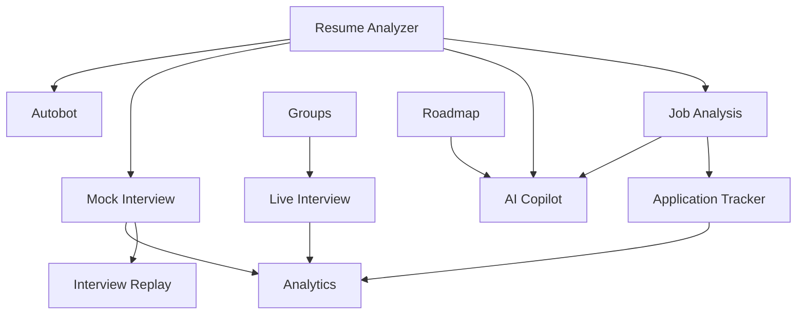

This illustrates the centrality of the resume domain and the way other features branch out from it.

---

## 52. Architecture Diagram: Frontend Module Constellation

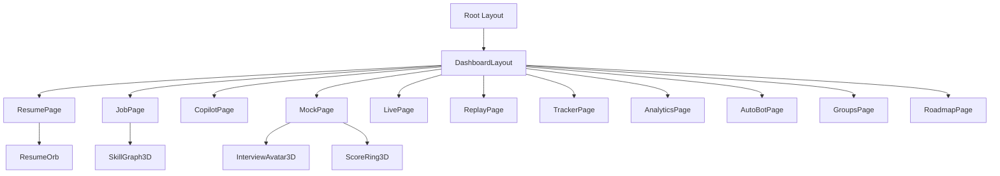

---

## 53. Architecture Diagram: Backend Module Constellation

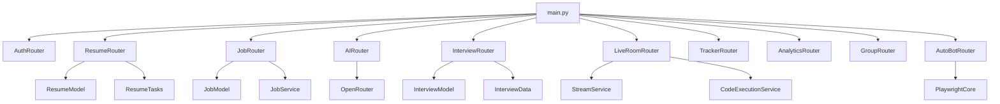

---

## 54. Why TalentIQ Is Technically Interesting

This is not a simple CRUD dashboard.

The codebase combines:

- product design polish
- LLM workflows
- async API handling
- background processing
- vector storage
- realtime communication
- browser automation
- code execution
- analytics
- 3D UI

These elements usually live in separate products, but here they are composed into one system.

---

## 55. Practical Onboarding Guide For A New Developer

If a new developer joins the project, the fastest understanding path is:

1. read `README.md`
2. read `backend/src/main.py`
3. read `frontend/src/lib/api.ts`
4. inspect `frontend/src/app` routes
5. inspect backend router files
6. understand `db.py`, `auth.py`, `feature_flags.py`
7. inspect `resume_router.py`, `job_router.py`, `ai_router.py`, and `interview_router.py`
8. inspect `resume_tasks.py` for async pattern understanding
9. inspect `docker-compose.yml`

This sequence gives product context before implementation detail.

---

## 56. Recommended Documentation Follow-Ups

This handbook is broad. The next documents that would add value are:

- API contract reference per endpoint
- database entity relationship guide
- deployment environment variable reference
- operations runbook for autobot
- live room troubleshooting guide
- testing guide and fixtures documentation

---

## 57. Glossary

### ATS

Applicant Tracking System style scoring of resumes against keywords and structure.

### pgvector

PostgreSQL extension for storing and querying vector embeddings.

### SSE

Server-Sent Events, used here for streaming copilot output.

### Resume Round

An interview mode that generates questions only from resume content.

### Piston

An external code execution service used for live coding features.

### Clerk

Authentication provider for frontend and backend identity flow.

### Stream

Realtime service family used for chat or video experiences.

---

## 58. Final Summary

TalentIQ is a multi-feature AI career platform with a modern full-stack architecture.

From the current repository, the key engineering characteristics are:

- strong feature modularity through router and route partitioning
- rich and highly interactive frontend
- pragmatic backend with async processing and external integrations
- resilient AI design through fallback strategies
- reusable core entities such as resume, job, match, and interview
- operational ambition through realtime and automation features

The most important mental model for this project is:

- `Resume` is the foundational candidate asset
- `Job` is the foundational opportunity asset
- `Interview` is the foundational practice/performance asset
- the rest of the platform connects these three pillars into a complete candidate workflow

---

## 59. Quick File Index

### 59.1 Root

- `README.md`
- `DEPLOY.md`
- `docker-compose.yml`
- `docker-compose.prod.yml`
- `package.json`
- `PROJECT_ARCHITECTURE_AND_FEATURE_GUIDE.md`

### 59.2 Backend API

- `backend/src/api/auth_router.py`
- `backend/src/api/resume_router.py`
- `backend/src/api/job_router.py`
- `backend/src/api/ai_router.py`
- `backend/src/api/interview_router.py`
- `backend/src/api/live_room_router.py`
- `backend/src/api/tracker_router.py`
- `backend/src/api/analytics_router.py`
- `backend/src/api/group_router.py`
- `backend/src/api/autobot_router.py`

### 59.3 Backend Core

- `backend/src/core/db.py`
- `backend/src/core/auth.py`
- `backend/src/core/feature_flags.py`
- `backend/src/core/openrouter_client.py`
- `backend/src/core/redis.py`

### 59.4 Backend Workers

- `backend/src/workers/celery_app.py`
- `backend/src/workers/resume_tasks.py`
- `backend/src/workers/job_tasks.py`
- `backend/src/workers/embed_tasks.py`
- `backend/src/workers/notify_tasks.py`
- `backend/src/workers/retention_tasks.py`

### 59.5 Frontend Routes

- `frontend/src/app/page.tsx`
- `frontend/src/app/dashboard/page.tsx`
- `frontend/src/app/resume/page.tsx`
- `frontend/src/app/job-analysis/page.tsx`
- `frontend/src/app/copilot/page.tsx`
- `frontend/src/app/mock-interview/page.tsx`
- `frontend/src/app/live-interview/page.tsx`
- `frontend/src/app/interview-replay/page.tsx`
- `frontend/src/app/tracker/page.tsx`
- `frontend/src/app/analytics/page.tsx`
- `frontend/src/app/autobot/page.tsx`
- `frontend/src/app/groups/page.tsx`
- `frontend/src/app/roadmap/page.tsx`

### 59.6 Frontend Shared

- `frontend/src/lib/api.ts`
- `frontend/src/middleware.ts`
- `frontend/src/app/layout.tsx`
- `frontend/src/components/DashboardLayout.tsx`
- `frontend/src/components/Navbar.tsx`
- `frontend/src/components/Footer.tsx`

---

## 60. Detailed Feature Block Diagrams And Workflows

This section goes deeper than the earlier architectural overview.

For each main feature shown in the product navigation, this section includes:

- a block diagram
- a detailed end-to-end workflow
- an explanation of what each block does
- the frontend and backend role in the flow

The purpose is to make the document useful not only for high-level overview, but also for feature implementation, onboarding, demo explanation, and system review.

---

### 60.1 Dashboard

#### Purpose

The dashboard is the platform summary layer. It does not create the main business data itself. Instead, it aggregates signals from other modules and gives the user a quick operational overview.

#### Block Diagram

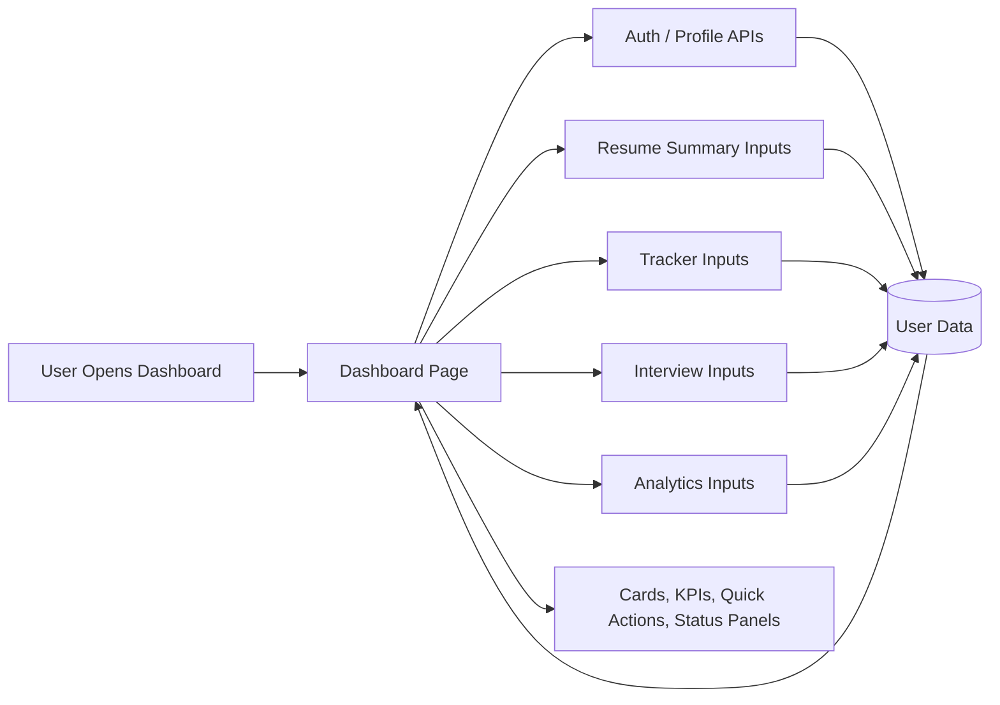

#### Workflow

1. The user opens the dashboard route.
2. The frontend loads summary data from profile, tracker, resume, interview, and analytics related endpoints.
3. The backend validates the token and returns user-scoped summary information.
4. The dashboard renders progress and action cards.
5. The user navigates into deeper modules from the dashboard shortcuts.

#### Block Explanation

- `User Opens Dashboard`
  - starts the session from a central home area after login.
- `Dashboard Page`
  - the frontend aggregation surface that coordinates multiple feature summaries.
- `Auth / Profile APIs`
  - identify the user and show role-aware information.
- `Resume Summary Inputs`
  - provide latest resume status, score, and related intelligence.
- `Tracker Inputs`
  - provide application activity and status counts.
- `Interview Inputs`
  - provide recent interview performance or reminders.
- `Analytics Inputs`
  - provide trend and insight data.
- `User Data / DB`
  - stores the shared records used across all dashboard cards.
- `Cards, KPIs, Quick Actions, Status Panels`
  - final visual presentation for the user.

---

### 60.2 Resume AI

#### Purpose

Resume AI converts a raw uploaded PDF into structured candidate intelligence.

#### Block Diagram

```mermaid
flowchart TD
    A[User Uploads Resume PDF] --> B[Resume Page UI]
    B --> C[POST /v1/resumes/upload]
    C --> D[resume_router Validation]
    D --> E[Resume Row Created]
    E --> F[Celery Task or Async Fallback]
    F --> G[PyMuPDF Text Extraction]
    G --> H[Structured Resume Parsing]
    H --> I[ATS And Quality Scoring]
    I --> J[Resume Saved As Done]
    J --> K[Embedding Generation]
    K --> L[pgvector Document Embeddings]
    J --> M[GET /v1/resumes/{id} Polling]
    M --> N[Frontend Visualization]
```

#### Workflow

1. The user drags or selects a PDF file.
2. The resume page uploads the file with role and experience metadata.
3. The backend validates the file and stores a `Resume` record in pending state.
4. A background task begins parsing the resume.
5. PDF text is extracted using PyMuPDF.
6. Text is transformed into structured JSON such as skills, experience, education, and projects.
7. ATS and quality scores are calculated.
8. The resume status changes to `done`.
9. The frontend polls the resume details endpoint until parsing completes.
10. After completion, the user sees structured resume insights and scores.
11. Embeddings are also created for later semantic use.

#### Block Explanation

- `User Uploads Resume PDF`
  - provides the source document for all downstream candidate features.
- `Resume Page UI`
  - captures file, role, and experience level.
- `POST /v1/resumes/upload`
  - sends the multipart upload request to the backend.
- `resume_router Validation`
  - checks file type, size, user role, and feature flags.
- `Resume Row Created`
  - stores metadata and establishes an ID for polling.
- `Celery Task or Async Fallback`
  - offloads heavy work from the request-response cycle.
- `PyMuPDF Text Extraction`
  - reads PDF page content into plain text.
- `Structured Resume Parsing`
  - extracts usable sections for later features.
- `ATS And Quality Scoring`
  - converts resume text into measurable product output.
- `Resume Saved As Done`
  - marks the resume available for UI consumption.
- `Embedding Generation`
  - chunks resume text and generates vector embeddings.
- `pgvector Document Embeddings`
  - stores semantic vectors for retrieval use cases.
- `GET /v1/resumes/{id} Polling`
  - keeps the frontend updated without blocking the original request.
- `Frontend Visualization`
  - turns raw backend output into charts, scores, and summaries.

---

### 60.3 Job Match

#### Purpose

Job Match evaluates how closely a resume aligns with a job description and highlights skill gaps, strengths, and recommendations.

#### Block Diagram

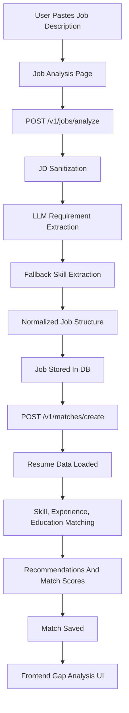

#### Workflow

1. The user pastes a job description in the Job Match page.
2. The frontend sends the JD to `/jobs/analyze`.
3. The backend sanitizes the text and removes possible accidental resume contamination.
4. AI attempts to extract structured fields like title, skills, tools, level, and education.
5. Fallback logic runs if the AI output is weak.
6. The job is stored in structured form.
7. The frontend then requests a match between the selected resume and the job.
8. The backend compares skills, tools, experience, and education.
9. Match score, missing skills, strengths, and recommendations are generated.
10. The frontend renders a visual breakdown for the user.

#### Block Explanation

- `User Pastes Job Description`
  - supplies the opportunity context.
- `Job Analysis Page`
  - UI for JD input, match request, and results.
- `POST /v1/jobs/analyze`
  - creates a structured job record.
- `JD Sanitization`
  - protects quality by removing noisy or incorrect user input.
- `LLM Requirement Extraction`
  - extracts structured job requirements.
- `Fallback Skill Extraction`
  - ensures minimum usability when AI extraction is incomplete.
- `Normalized Job Structure`
  - standardizes fields like must-have and nice-to-have skills.
- `Job Stored In DB`
  - persists the structured job for reuse.
- `POST /v1/matches/create`
  - triggers comparison logic.
- `Resume Data Loaded`
  - loads the resume’s parsed_json and text context.
- `Skill, Experience, Education Matching`
  - core business comparison engine.
- `Recommendations And Match Scores`
  - transforms comparison into actionable output.
- `Match Saved`
  - preserves results for analytics and later access.
- `Frontend Gap Analysis UI`
  - shows missing skills, strengths, percentages, and suggestions.

---

### 60.4 AI Copilot

#### Purpose

AI Copilot is the assistant layer that responds to career questions, generates writing assets, and uses user context to provide guidance.

#### Block Diagram

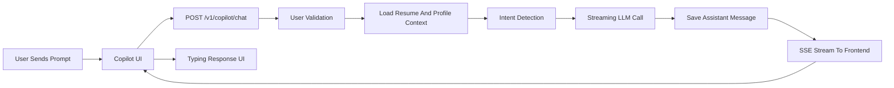

#### Workflow

1. The user enters a question or task in Copilot.
2. The frontend sends the prompt to the chat endpoint.
3. The backend loads the user and chat session.
4. The latest resume context is injected into the prompt.
5. Intent detection tries to classify the task type.
6. A streaming AI response is initiated.
7. Tokens are sent incrementally to the frontend through SSE.
8. The full assistant message is saved at the end of the stream.

#### Block Explanation

- `User Sends Prompt`
  - the natural-language input for the AI mentor.
- `Copilot UI`
  - the frontend surface for streaming chat and assistant utilities.
- `POST /v1/copilot/chat`
  - backend entry point for streaming advice.
- `User Validation`
  - ensures authenticated, user-scoped data access.
- `Load Resume And Profile Context`
  - adds personalization to AI output.
- `Intent Detection`
  - routes the request into the right AI behavior style.
- `Streaming LLM Call`
  - produces output token-by-token for better UX.
- `Save Assistant Message`
  - stores the conversation history.
- `SSE Stream To Frontend`
  - pushes deltas incrementally to the browser.
- `Typing Response UI`
  - presents the answer in a conversational format.

---

### 60.5 Auto Job Bot

#### Purpose

Auto Job Bot automates repetitive job application work across supported platforms like LinkedIn, Naukri, and YC.

#### Block Diagram

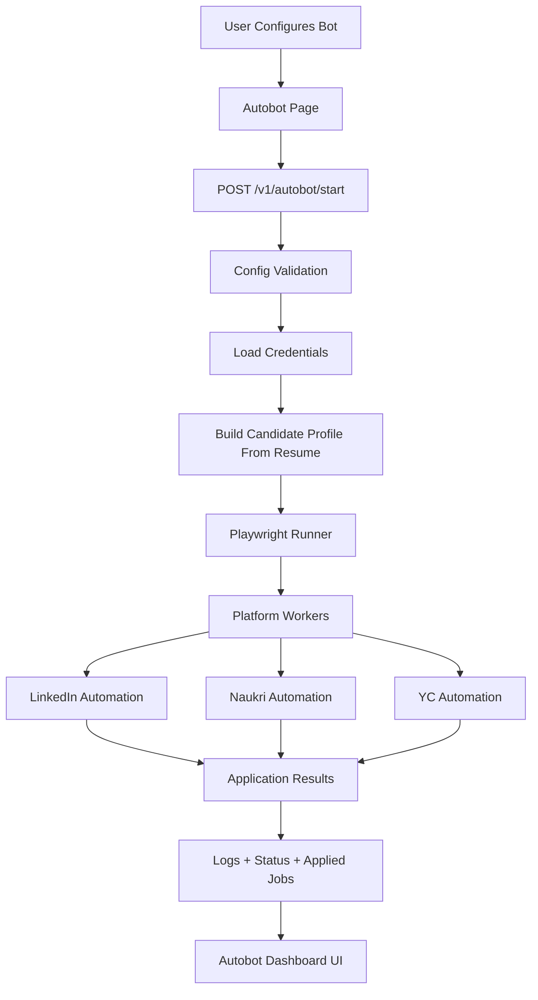

#### Workflow

1. The user configures keywords, locations, platform toggles, and limits.
2. The frontend calls the autobot start endpoint.
3. The backend validates config and credentials.
4. Candidate profile context can be derived from the resume.
5. The bot runner launches browser automation with Playwright.
6. Platform-specific workers search and apply to jobs.
7. Every attempt is logged.
8. Results are written to applied job tracking data.
9. The UI reads status, logs, and applied job outcomes continuously.

#### Block Explanation

- `User Configures Bot`
  - defines the automation strategy.
- `Autobot Page`
  - control panel for lifecycle, logs, and outcomes.
- `POST /v1/autobot/start`
  - start command for the automation engine.
- `Config Validation`
  - checks preferences and safety constraints.
- `Load Credentials`
  - loads secure platform login data.
- `Build Candidate Profile From Resume`
  - makes the bot resume-aware.
- `Playwright Runner`
  - launches and coordinates browser automation.
- `Platform Workers`
  - dispatches to platform-specific code paths.
- `LinkedIn Automation`
  - handles LinkedIn job application flows.
- `Naukri Automation`
  - handles Naukri job application flows.
- `YC Automation`
  - handles YC Work at a Startup flows.
- `Application Results`
  - success, skipped, failed, manual-needed, or external states.
- `Logs + Status + Applied Jobs`
  - observability layer for the user.
- `Autobot Dashboard UI`
  - presents current runtime behavior and results.

---

### 60.6 Mock Interview

#### Purpose

Mock Interview simulates structured role-based or resume-based interviews with feedback after every answer.

#### Block Diagram

```mermaid
flowchart TD
    A[User Chooses Role And Round] --> B[Mock Interview Page]
    B --> C[GET /v1/interviews/options]
    B --> D[Optional Resume Upload Or Selection]
    B --> E[POST /v1/interviews/start]
    E --> F[Interview Record Created]
    F --> G[Question Generation]
    G --> G1[LLM Questions]
    G --> G2[Static Fallback Questions]
    G1 --> H[Questions Stored]
    G2 --> H
    H --> I[Question Rendered To User]
    I --> J[User Answer Submission]
    J --> K[POST /v1/interviews/{id}/answer]
    K --> L[LLM Or Heuristic Scoring]
    L --> M[Feedback Saved]
    M --> N[Next Question Or Finish]
    N --> O[Report + Replay Data]
```

#### Workflow

1. The user selects role, interview round, and recruiter persona.
2. If `Resume round` is selected, the user can upload or choose a parsed resume.
3. The frontend requests interview startup.
4. The backend creates interview and question records.
5. Questions are generated via LLM or static fallback.
6. The first question is returned.
7. The user answers via text or voice-assisted input.
8. The backend scores the answer and stores feedback.
9. This repeats until the interview is complete.
10. The backend creates report and replay information.
11. The frontend displays coaching feedback and analysis.

#### Block Explanation

- `User Chooses Role And Round`
  - defines the interview scenario.
- `Mock Interview Page`
  - manages UI state, timing, and answer flow.
- `GET /v1/interviews/options`
  - fetches roles and round types from backend source of truth.
- `Optional Resume Upload Or Selection`
  - supports resume-grounded interview sessions.
- `POST /v1/interviews/start`
  - creates the interview session.
- `Interview Record Created`
  - stores the parent interview entity.
- `Question Generation`
  - creates the actual interview prompts.
- `LLM Questions`
  - AI-generated interview questions.
- `Static Fallback Questions`
  - deterministic backup question source.
- `Questions Stored`
  - persists prompts for replay and report generation.
- `Question Rendered To User`
  - presents a single step in the interview sequence.
- `User Answer Submission`
  - sends the candidate response.
- `POST /v1/interviews/{id}/answer`
  - scores and advances the interview.
- `LLM Or Heuristic Scoring`
  - evaluation logic for answer quality.
- `Feedback Saved`
  - persists feedback and score history.
- `Next Question Or Finish`
  - controls the loop.
- `Report + Replay Data`
  - final learning outputs for the user.

---

### 60.7 Live Room

#### Purpose

Live Room supports real-time collaborative or interviewer-led sessions with video and code execution.

#### Block Diagram

```mermaid
flowchart LR
    A[User Creates Or Joins Room] --> B[Live Room Frontend]
    B --> C[POST /v1/rooms/create or join]
    C --> D[Room Validation]
    D --> E[LiveRoom Record]
    E --> F[Stream Token / Session Setup]
    F --> G[Video And Presence Layer]
    B --> H[Monaco Code Editor]
    H --> I[POST /v1/rooms/{id}/execute-code]
    I --> J[CodeExecutionService]
    J --> K[Piston Runtime]
    K --> L[Execution Output]
    L --> B
```

#### Workflow

1. A user creates or joins a room.
2. The backend validates access and room state.
3. Stream-related session information is prepared.
4. Participants interact through the live session UI.
5. Shared code is edited in Monaco.
6. Code execution requests are sent to the backend.
7. The backend forwards execution to the runtime service.
8. Output is returned and displayed in the room.

#### Block Explanation

- `User Creates Or Joins Room`
  - starts the live session lifecycle.
- `Live Room Frontend`
  - orchestrates room state, participants, and tools.
- `POST /v1/rooms/create or join`
  - room lifecycle API entry.
- `Room Validation`
  - checks room state and permissions.
- `LiveRoom Record`
  - persistent room metadata.
- `Stream Token / Session Setup`
  - configures realtime presence and communication.
- `Video And Presence Layer`
  - handles the actual live session interaction model.
- `Monaco Code Editor`
  - interactive code surface for technical discussion.
- `POST /v1/rooms/{id}/execute-code`
  - sends code execution request.
- `CodeExecutionService`
  - service wrapper around execution engine.
- `Piston Runtime`
  - executes user code safely in isolated environment.
- `Execution Output`
  - returned result shown in UI.

---

### 60.8 Replay

#### Purpose

Replay allows users to inspect what happened in a completed interview in sequence.

#### Block Diagram

```mermaid
flowchart TD
    A[Completed Interview] --> B[Replay JSON Generated]
    B --> C[Stored In Interview Record]
    C --> D[GET /v1/interviews/{id}/replay]
    D --> E[Replay Page]
    E --> F[Timeline View]
    E --> G[Score Delta View]
    E --> H[Per-Question Feedback View]
```

#### Workflow

1. The user finishes a mock interview.
2. The backend computes replay timeline items during finish processing.
3. Replay JSON is stored in the interview record.
4. The replay page fetches replay data.
5. The UI displays question order, answers, score changes, and feedback.

#### Block Explanation

- `Completed Interview`
  - the prerequisite state for replay.
- `Replay JSON Generated`
  - timeline representation of the session.
- `Stored In Interview Record`
  - persistence of replay data for future access.
- `GET /v1/interviews/{id}/replay`
  - retrieval endpoint for replay.
- `Replay Page`
  - frontend presentation surface.
- `Timeline View`
  - ordered sequence of interview events.
- `Score Delta View`
  - shows changes in performance question by question.
- `Per-Question Feedback View`
  - lets the user inspect mistakes and coaching tips.

---

### 60.9 Group Chat

#### Purpose

Group Chat supports peer collaboration, messaging, file sharing, and shared coding context.

#### Block Diagram

```mermaid
flowchart TD
    A[User Opens Group Module] --> B[Groups Page]
    B --> C[GET /v1/groups]
    C --> D[Group Records]
    B --> E[POST /v1/groups]
    B --> F[GET /v1/groups/{id}/messages]
    B --> G[POST /v1/groups/{id}/messages]
    B --> H[POST /v1/groups/{id}/files]
    B --> I[PATCH /v1/groups/{id}/code]
    G --> J[Message Persistence]
    H --> K[File Metadata Persistence]
    I --> L[Shared Code Persistence]
    J --> M[Chat UI]
    K --> M
    L --> M
```

#### Workflow

1. The user lists existing groups or creates a new one.
2. Messages are fetched for the selected group.
3. The user sends messages, uploads files, or updates shared code.
4. The backend persists each artifact.
5. The frontend updates the group experience with the latest collaboration state.

#### Block Explanation

- `User Opens Group Module`
  - starts collaboration flow.
- `Groups Page`
  - central UI for group management and communication.
- `GET /v1/groups`
  - lists accessible groups.
- `Group Records`
  - persistent metadata for groups.
- `POST /v1/groups`
  - creates a group container.
- `GET /v1/groups/{id}/messages`
  - loads message history.
- `POST /v1/groups/{id}/messages`
  - creates new chat content.
- `POST /v1/groups/{id}/files`
  - uploads group files.
- `PATCH /v1/groups/{id}/code`
  - saves shared code state.
- `Message Persistence`
  - stores conversation history.
- `File Metadata Persistence`
  - stores uploaded file metadata.
- `Shared Code Persistence`
  - stores latest collaborative code version.
- `Chat UI`
  - renders the combined collaborative experience.

---

### 60.10 Tracker

#### Purpose

Tracker is the operational job pipeline manager for applications and follow-ups.

#### Block Diagram

```mermaid
flowchart LR
    A[User Manages Applications] --> B[Tracker Page]
    B --> C[POST /v1/applications]
    B --> D[PATCH /v1/applications/{id}]
    B --> E[GET /v1/applications]
    B --> F[GET /v1/applications/timeline]
    B --> G[GET /v1/applications/analytics]
    C --> H[Application Record Created]
    D --> I[Status / Notes Updated]
    E --> J[Board And List Data]
    F --> K[Timeline Data]
    G --> L[Tracker Metrics]
    J --> M[Kanban And Status UI]
    K --> M
    L --> M
```

#### Workflow

1. The user creates or imports an application record.
2. Applications can be updated as they move from saved to applied to interview and beyond.
3. The tracker page requests current records, history, and summary analytics.
4. The backend returns status-aware data.
5. The frontend renders board views, timelines, and status summaries.

#### Block Explanation

- `User Manages Applications`
  - the operational part of job search execution.
- `Tracker Page`
  - UI for creating, updating, and reviewing applications.
- `POST /v1/applications`
  - adds a new application.
- `PATCH /v1/applications/{id}`
  - edits stage, notes, reminders, or related fields.
- `GET /v1/applications`
  - loads the current application list.
- `GET /v1/applications/timeline`
  - loads event history.
- `GET /v1/applications/analytics`
  - loads summary metrics.
- `Application Record Created`
  - initial persisted tracker entity.
- `Status / Notes Updated`
  - operational state management.
- `Board And List Data`
  - current visual tracker state.
- `Timeline Data`
  - historical view of application progress.
- `Tracker Metrics`
  - counts, funnel indicators, and summaries.
- `Kanban And Status UI`
  - final user-facing management interface.

---

### 60.11 Roadmap

#### Purpose

Roadmap gives the user a guided learning plan based on role and level.

#### Block Diagram

```mermaid
flowchart TD
    A[User Selects Role And Level] --> B[Roadmap Page]
    B --> C[GET /v1/copilot/roadmap/options]
    B --> D[POST /v1/copilot/roadmap]
    D --> E[Optional Resume Context]
    E --> F[LLM Roadmap Generation]
    F --> G[Static Fallback Roadmap]
    G --> H[12-Week Structured Plan]
    H --> I[Frontend Weekly Roadmap UI]
```

#### Workflow

1. The user selects a target role and experience level.
2. The frontend loads available options from the backend.
3. The roadmap generation request is sent.
4. Optional resume context is added if available.
5. The backend tries LLM roadmap generation first.
6. If needed, it falls back to static roadmap data.
7. The frontend renders the plan week by week.

#### Block Explanation

- `User Selects Role And Level`
  - defines the desired learning path.
- `Roadmap Page`
  - UI for options and result display.
- `GET /v1/copilot/roadmap/options`
  - fetches role and level choices.
- `POST /v1/copilot/roadmap`
  - roadmap generation request.
- `Optional Resume Context`
  - personalizes the plan when candidate data exists.
- `LLM Roadmap Generation`
  - dynamic roadmap creation.
- `Static Fallback Roadmap`
  - guaranteed usability if AI generation fails.
- `12-Week Structured Plan`
  - normalized output format.
- `Frontend Weekly Roadmap UI`
  - final structured learning display.

---

### 60.12 Analytics

#### Purpose

Analytics converts user actions and outcomes into interpretable trends and summary signals.

#### Block Diagram

```mermaid
flowchart TD
    A[User Opens Analytics] --> B[Analytics Page]
    B --> C[GET /v1/analytics/dashboard]
    B --> D[GET /v1/analytics/skills]
    B --> E[GET /v1/analytics/interviews]
    C --> F[Application And Product Summary]
    D --> G[Skill Trend Summary]
    E --> H[Interview Performance Summary]
    F --> I[Analytics Visual UI]
    G --> I
    H --> I
```

#### Workflow

1. The user opens the analytics route.
2. The frontend requests dashboard, skill, and interview analytics.
3. The backend aggregates data from applications, resume history, and interview results.
4. The frontend renders trend charts and summary cards.

#### Block Explanation

- `User Opens Analytics`
  - starts the insight workflow.
- `Analytics Page`
  - chart and metrics surface.
- `GET /v1/analytics/dashboard`
  - application and summary metrics.
- `GET /v1/analytics/skills`
  - skills-related trend output.
- `GET /v1/analytics/interviews`
  - interview score and frequency insights.
- `Application And Product Summary`
  - aggregated operational metrics.
- `Skill Trend Summary`
  - growth and coverage trends.
- `Interview Performance Summary`
  - learning and readiness signals.
- `Analytics Visual UI`
  - charts, cards, and comparisons.

---

### 60.13 Cross-Feature Integration Block Diagram

The following block diagram shows how all major features relate to each other through shared data.

```mermaid
flowchart TD
    Resume[Resume AI] --> JobMatch[Job Match]
    Resume --> Copilot[AI Copilot]
    Resume --> MockInterview[Mock Interview]
    Resume --> AutoBot[Auto Job Bot]
    JobMatch --> Tracker[Tracker]
    JobMatch --> Copilot
    MockInterview --> Replay[Replay]
    MockInterview --> Analytics[Analytics]
    Tracker --> Analytics
    GroupChat[Group Chat] --> LiveRoom[Live Room]
    LiveRoom --> Analytics
    Roadmap[Roadmap] --> Copilot
    Dashboard[Dashboard] --> Resume
    Dashboard --> JobMatch
    Dashboard --> Copilot
    Dashboard --> MockInterview
    Dashboard --> Tracker
    Dashboard --> Analytics
```

#### Cross-Feature Explanation

- `Dashboard`
  - acts as the system summary and navigation launch point.
- `Resume AI`
  - produces the candidate intelligence base that powers several downstream features.
- `Job Match`
  - compares opportunity data against the resume.
- `AI Copilot`
  - uses resume and job context to produce assistance.
- `Mock Interview`
  - can use role context or resume context.
- `Replay`
  - depends on completed mock interview history.
- `Tracker`
  - uses job and application progress signals.
- `Analytics`
  - aggregates events and outcomes from multiple modules.
- `Group Chat`
  - collaborative communication layer.
- `Live Room`
  - synchronous interactive session layer.
- `Roadmap`
  - guides growth and learning paths that complement other preparation tools.
- `Auto Job Bot`
  - operational automation layer driven partly by resume profile and user preferences.

---

### 60.14 Why These Detailed Diagrams Matter

These block diagrams are useful for several reasons:

- they help new developers understand where a feature starts and ends
- they make backend and frontend responsibilities clear
- they show where AI is optional versus required
- they identify persistence points and integration points
- they help during debugging and deployment reviews
- they can be reused in presentations, reports, and architecture handoff material

---

## 61. Closing Note

This file is intentionally detailed and long-form so it can serve as a handoff document, architecture guide, implementation map, and product overview in one place.

If you want this documentation split further, the best next refactor is:

- `docs/01-overview.md`
- `docs/02-frontend-architecture.md`
- `docs/03-backend-architecture.md`
- `docs/04-feature-workflows.md`
- `docs/05-api-reference.md`
- `docs/06-deployment-and-ops.md`

That would make the repo easier to maintain over time while preserving the same content.
