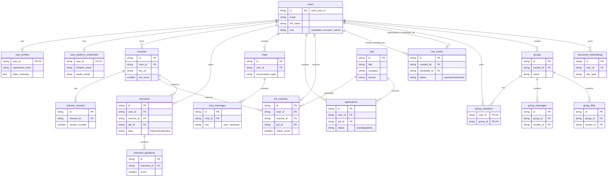

# Talent IQ Entity-Relationship Diagram

This diagram visualizes the primary models and their relationships as defined in the `talent-IQ-master` backend SQLAlchemy schema.

```mermaid
erDiagram
    users ||--o| user_profiles : "has"
    users ||--o| user_platform_credentials : "has"
    users ||--o{ resumes : "owns"
    users ||--o{ interviews : "takes"
    users ||--o{ chats : "creates"
    users ||--o{ applications : "submits"
    users ||--o{ job_matches : "receives"
    users ||--o{ live_rooms : "creates (created_by)"
    users ||--o{ live_rooms : "participates in (candidate_id)"
    users ||--o{ group_members : "joins"
    users ||--o{ groups : "creates"
    users ||--o{ document_embeddings : "owns"

    jobs ||--o{ job_matches : "generates"
    jobs ||--o{ applications : "receives"

    resumes ||--o{ resume_versions : "has"
    resumes ||--o{ job_matches : "used for"
    resumes ||--o{ interviews : "linked to"

    interviews ||--o{ interview_questions : "contains"
    
    chats ||--o{ chat_messages : "contains"
    
    groups ||--o{ group_members : "has"
    groups ||--o{ group_messages : "contains"
    groups ||--o{ group_files : "contains"
    
    users {
        string id PK "clerk_user_id"
        string email
        string full_name
        string role "candidate | recruiter | admin"
    }
    
    user_profiles {
        string user_id PK, FK
        string experience_level
        text skills_summary
    }
    
    user_platform_credentials {
        string user_id PK, FK
        string linkedin_email
        string naukri_email
    }

    resumes {
        string id PK
        string user_id FK
        string file_url
        smallint ats_score
    }
    
    resume_versions {
        string id PK
        string resume_id FK
        smallint version_number
    }

    jobs {
        string id PK
        string title
        string company
        string source
    }
    
    job_matches {
        string id PK
        string user_id FK
        string resume_id FK
        string job_id FK
        smallint match_score
    }
    
    interviews {
        string id PK
        string user_id FK
        string resume_id FK
        string job_id FK
        string type "hr|technical|coding"
    }
    
    interview_questions {
        string id PK
        string interview_id FK
        smallint score
    }
    
    live_rooms {
        string id PK
        string created_by FK
        string candidate_id FK
        string status "open|active|closed"
    }
    
    chats {
        string id PK
        string user_id FK
        string conversation_type
    }
    
    chat_messages {
        string id PK
        string chat_id FK
        string role "user | assistant"
    }
    
    applications {
        string id PK
        string user_id FK
        string job_id FK
        string status "saved|applied|..."
    }
    
    groups {
        string id PK
        string creator_id FK
        string name
    }
    
    group_members {
        string user_id PK, FK
        string group_id PK, FK
    }
    
    group_messages {
        string id PK
        string group_id FK
        string sender_id FK
    }
    
    group_files {
        string id PK
        string group_id FK
        string sender_id FK
    }
    
    document_embeddings {
        string id PK
        string user_id FK
        string doc_type
    }
```
